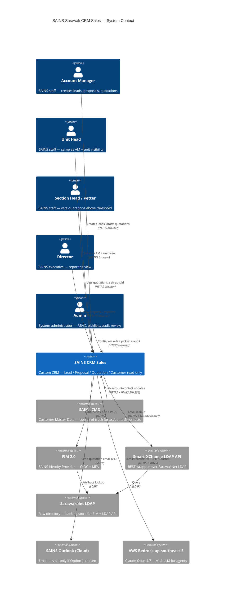
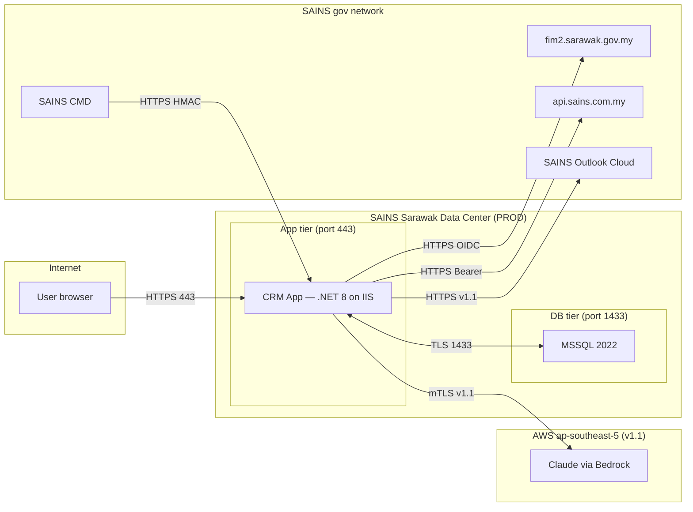

# System Context Diagram

```mermaid
C4Context
title SAINS Sarawak CRM Sales — System Context

Person(am, "Account Manager", "SAINS staff — creates leads, proposals, quotations")
Person(uh, "Unit Head", "SAINS staff — same as AM + unit visibility")
Person(sh, "Section Head / Vetter", "SAINS staff — vets quotations above threshold")
Person(dir, "Director", "SAINS executive — reporting view")
Person(admin, "Admin", "System administrator — RBAC, picklists, audit review")

System(crm, "SAINS CRM Sales", "Custom CRM — Lead / Proposal / Quotation / Customer read-only")

System_Ext(cmd, "SAINS CMD", "Customer Master Data — source of truth for accounts & contacts")
System_Ext(fim, "FIM 2.0", "SAINS Identity Provider — OIDC + MFA")
System_Ext(ldap_api, "Smart-XChange LDAP API", "REST wrapper over SarawakNet LDAP")
System_Ext(ldap, "SarawakNet LDAP", "Raw directory — backing store for FIM + LDAP API")
System_Ext(outlook, "SAINS Outlook (Cloud)", "Email — v1.1 only if Option 1 chosen")
System_Ext(bedrock, "AWS Bedrock ap-southeast-5", "Claude Opus 4.7 — v1.1 LLM for agents")

Rel(am, crm, "Creates leads, drafts quotations", "HTTPS browser")
Rel(uh, crm, "Same as AM + unit view", "HTTPS browser")
Rel(sh, crm, "Vets quotations ≥ threshold", "HTTPS browser")
Rel(dir, crm, "Views reports + pipeline", "HTTPS browser")
Rel(admin, crm, "Configures roles, picklists, audit", "HTTPS browser")

Rel(crm, fim, "OIDC Auth Code + PKCE", "HTTPS")
Rel(crm, ldap_api, "Email lookup", "HTTPS + OAuth2 Bearer")
Rel(cmd, crm, "Push account/contact updates", "HTTPS + HMAC-SHA256")
Rel(crm, outlook, "Send quotation email (v1.1)", "SMTP")
Rel(crm, bedrock, "LLM inference (v1.1, PII-redacted)", "HTTPS + mTLS")

Rel(fim, ldap, "Attribute lookup", "LDAP")
Rel(ldap_api, ldap, "Query", "LDAP")
```

## Trust boundaries

```mermaid
flowchart LR
    subgraph Internet
        user[User browser]
    end
    subgraph "SAINS Sarawak Data Center (PROD)"
        subgraph "App tier (port 443)"
            crm[CRM App — .NET 8 on IIS]
        end
        subgraph "DB tier (port 1433)"
            mssql[MSSQL 2022]
        end
    end
    subgraph "SAINS gov network"
        fim[fim2.sarawak.gov.my]
        ldap_api[api.sains.com.my]
        cmd[SAINS CMD]
        outlook[SAINS Outlook Cloud]
    end
    subgraph "AWS ap-southeast-5 (v1.1)"
        bedrock[Claude via Bedrock]
    end

    user -->|HTTPS 443| crm
    crm <-->|TLS 1433| mssql
    crm -->|HTTPS OIDC| fim
    crm -->|HTTPS Bearer| ldap_api
    cmd -->|HTTPS HMAC| crm
    crm -->|HTTPS v1.1| outlook
    crm -->|mTLS v1.1| bedrock
```
