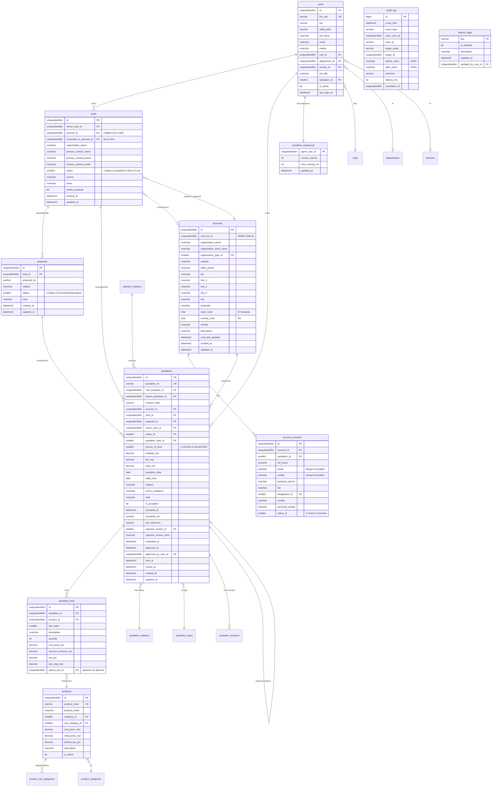

# Entity-Relationship Diagram

```mermaid
erDiagram
    users ||--o{ leads               : owns
    users ||--o{ quotations          : owns
    users ||--|| quotation_sequences : "has sequence"
    users }o--|| roles               : has
    users }o--o| departments         : in
    users }o--o| sections            : in

    accounts ||--o{ account_contacts : has
    accounts ||--o{ leads            : "linked to (optional)"
    accounts ||--o{ quotations       : "quoted for"

    leads ||--o{ proposals           : may-generate
    leads ||--o{ quotations          : may-generate
    leads }o--o| accounts            : converted-to

    proposals ||--o{ quotations      : "converted to"

    quotations ||--o{ quotation_lines     : has
    quotations }o--|| quotation_statuses  : has-status
    quotations }o--|| quotation_types     : is-type
    quotations ||--o{ quotation_revisions : "root of chain"
    quotations ||--o| quotations          : "parent (revision)"

    products ||--o{ product_sub_categories : categorised-by
    products }o--|| product_categories     : in
    quotation_lines }o--|| products        : references

    rejection_reasons ||--o{ quotations : used-by

    accounts {
        uniqueidentifier id PK
        uniqueidentifier cmd_ref_id "SAINS CMD ID"
        nvarchar organization_name
        nvarchar organization_short_name
        smallint organization_type_id FK
        nvarchar website
        nvarchar office_phone
        nvarchar fax
        nvarchar line_1
        nvarchar line_2
        nvarchar line_3
        nvarchar city
        nvarchar postcode
        char state_code "E=Sarawak"
        char country_code "MY"
        nvarchar remark
        nvarchar description
        datetime2 cmd_last_updated
        datetime2 created_at
        datetime2 updated_at
    }

    account_contacts {
        uniqueidentifier id PK
        uniqueidentifier account_id FK
        smallint salutation_id FK
        nvarchar full_name
        nvarchar email "Always Encrypted"
        nvarchar mobile "Always Encrypted"
        nvarchar business_phone
        nvarchar fax
        smallint designation_id FK
        nvarchar remark
        nvarchar personal_remark
        smallint status_id "1=Active,2=InActive"
    }

    leads {
        uniqueidentifier id PK
        uniqueidentifier owner_user_id FK
        uniqueidentifier account_id FK "nullable if pre-CMD"
        uniqueidentifier converted_to_account_id FK "set on Win"
        nvarchar organization_name
        nvarchar primary_contact_name
        nvarchar primary_contact_phone
        nvarchar primary_contact_email
        smallint status "1=Open,2=Qualified,3=Won,4=Lost"
        nvarchar source
        nvarchar notes
        bit needs_proposal
        datetime2 created_at
        datetime2 updated_at
    }

    proposals {
        uniqueidentifier id PK
        uniqueidentifier lead_id FK
        varchar proposal_no
        nvarchar subject
        smallint status "1=Open,2=ConvertedToQuotation"
        nvarchar note
        datetime2 created_at
        datetime2 updated_at
    }

    quotations {
        uniqueidentifier id PK
        varchar quotation_no UK
        uniqueidentifier root_quotation_id FK
        uniqueidentifier parent_quotation_id FK
        varchar revision_letter
        uniqueidentifier account_id FK
        uniqueidentifier lead_id FK
        uniqueidentifier proposal_id FK
        uniqueidentifier owner_user_id FK
        smallint status_id FK
        smallint quotation_type_id FK
        smallint source_of_fund "1=SCSDU,2=NonSCSDU"
        decimal subtotal_myr
        decimal tax_myr
        decimal total_myr
        date quotation_date
        date valid_until
        nvarchar subject
        nvarchar terms_conditions
        nvarchar note
        bit is_accepted
        datetime2 accepted_at
        varchar accepted_via
        varchar wot_reference
        smallint rejection_reason_id FK
        nvarchar rejection_reason_other
        datetime2 submitted_at
        datetime2 approved_at
        uniqueidentifier approved_by_user_id FK
        datetime2 sent_at
        datetime2 closed_at
        datetime2 created_at
        datetime2 updated_at
    }

    quotation_lines {
        uniqueidentifier id PK
        uniqueidentifier quotation_id FK
        uniqueidentifier product_id FK
        smallint line_order
        nvarchar description
        int quantity
        decimal unit_price_myr
        decimal discount_amount_myr
        decimal tax_pct
        decimal line_total_myr
        uniqueidentifier parent_line_id FK "optional, for add-ons"
    }

    products {
        uniqueidentifier id PK
        varchar product_code UK
        nvarchar product_name
        smallint category_id FK
        smallint sub_category_id FK
        decimal cost_price_myr
        decimal retail_price_myr
        decimal default_tax_pct
        nvarchar description
        bit is_active
    }

    quotation_sequences {
        uniqueidentifier agent_user_id PK
        int current_volume
        int next_running_no
        datetime2 updated_at
    }

    audit_log {
        bigint id PK
        datetime2 event_time
        varchar event_type
        uniqueidentifier actor_user_id
        varchar actor_ip
        varchar target_entity
        uniqueidentifier target_id
        nvarchar before_value "JSON"
        nvarchar after_value "JSON"
        varchar outcome
        int latency_ms
        uniqueidentifier correlation_id
    }

    users {
        uniqueidentifier id PK
        varchar fim_sub UK
        varchar uid
        varchar staff_prefix
        nvarchar full_name
        nvarchar email
        nvarchar mobile
        uniqueidentifier role_id FK
        uniqueidentifier department_id FK
        uniqueidentifier section_id FK
        nvarchar job_title
        smallint salutation_id FK
        bit is_active
        datetime2 last_login_at
    }

    feature_flags {
        varchar key PK
        bit is_enabled
        nvarchar description
        datetime2 updated_at
        uniqueidentifier updated_by_user_id FK
    }
```
