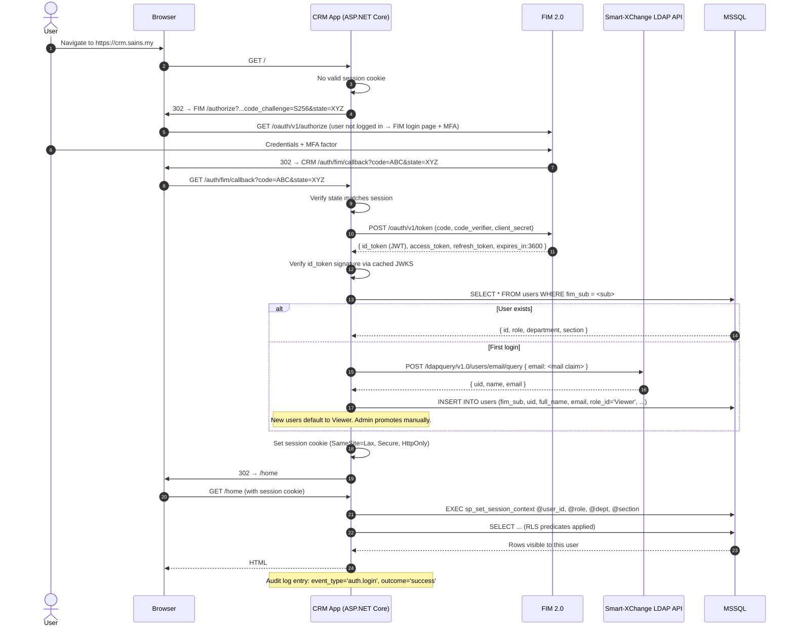
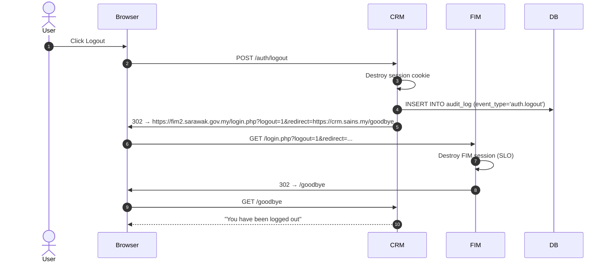

# Auth Sequence — FIM 2.0 OIDC Authorization Code + PKCE

```mermaid
sequenceDiagram
    autonumber
    actor User
    participant Browser
    participant CRM as CRM App (ASP.NET Core)
    participant FIM as FIM 2.0
    participant LDAPAPI as Smart-XChange LDAP API
    participant DB as MSSQL

    User->>Browser: Navigate to https://crm.sains.my
    Browser->>CRM: GET /
    CRM->>CRM: No valid session cookie
    CRM->>Browser: 302 → FIM /authorize?...code_challenge=S256&state=XYZ
    Browser->>FIM: GET /oauth/v1/authorize (user not logged in → FIM login page + MFA)
    User->>FIM: Credentials + MFA factor
    FIM->>Browser: 302 → CRM /auth/fim/callback?code=ABC&state=XYZ
    Browser->>CRM: GET /auth/fim/callback?code=ABC&state=XYZ

    CRM->>CRM: Verify state matches session
    CRM->>FIM: POST /oauth/v1/token (code, code_verifier, client_secret)
    FIM-->>CRM: { id_token (JWT), access_token, refresh_token, expires_in:3600 }

    CRM->>CRM: Verify id_token signature via cached JWKS
    CRM->>DB: SELECT * FROM users WHERE fim_sub = <sub>
    alt User exists
        DB-->>CRM: { id, role, department, section }
    else First login
        CRM->>LDAPAPI: POST /ldapquery/v1.0/users/email/query { email: <mail claim> }
        LDAPAPI-->>CRM: { uid, name, email }
        CRM->>DB: INSERT INTO users (fim_sub, uid, full_name, email, role_id='Viewer', ...)
        Note over CRM: New users default to Viewer. Admin promotes manually.
    end

    CRM->>CRM: Set session cookie (SameSite=Lax, Secure, HttpOnly)
    CRM->>Browser: 302 → /home
    Browser->>CRM: GET /home (with session cookie)

    CRM->>DB: EXEC sp_set_session_context @user_id, @role, @dept, @section
    CRM->>DB: SELECT ... (RLS predicates applied)
    DB-->>CRM: Rows visible to this user
    CRM-->>Browser: HTML

    Note over CRM: Audit log entry: event_type='auth.login', outcome='success'
```

## Logout sequence

```mermaid
sequenceDiagram
    autonumber
    actor User
    participant Browser
    participant CRM
    participant FIM

    User->>Browser: Click Logout
    Browser->>CRM: POST /auth/logout
    CRM->>CRM: Destroy session cookie
    CRM->>DB: INSERT INTO audit_log (event_type='auth.logout')
    CRM->>Browser: 302 → https://fim2.sarawak.gov.my/login.php?logout=1&redirect=https://crm.sains.my/goodbye
    Browser->>FIM: GET /login.php?logout=1&redirect=...
    FIM->>FIM: Destroy FIM session (SLO)
    FIM->>Browser: 302 → /goodbye
    Browser->>CRM: GET /goodbye
    CRM-->>Browser: "You have been logged out"
```
