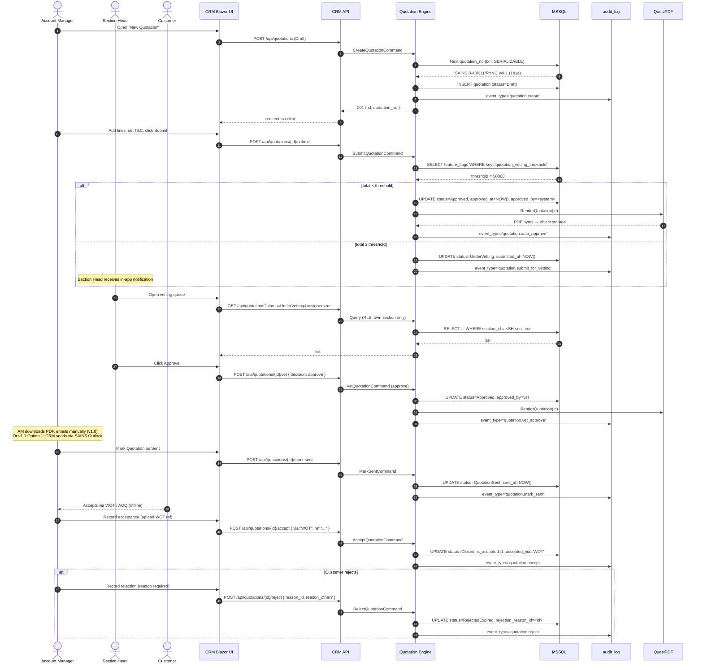
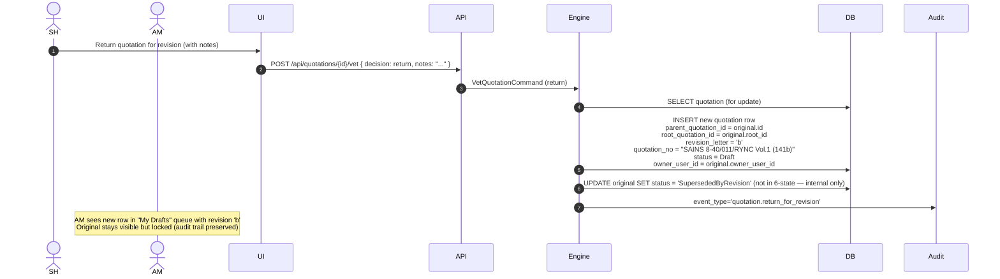

# Quotation Lifecycle — Sequence Diagram

```mermaid
sequenceDiagram
    autonumber
    actor AM as Account Manager
    actor SH as Section Head
    actor Customer
    participant UI as CRM Blazor UI
    participant API as CRM API
    participant Engine as Quotation Engine
    participant DB as MSSQL
    participant Audit as audit_log
    participant PDFSvc as QuestPDF

    AM->>UI: Open "New Quotation"
    UI->>API: POST /api/quotations (Draft)
    API->>Engine: CreateQuotationCommand
    Engine->>DB: Next quotation_no (txn, SERIALIZABLE)
    DB-->>Engine: "SAINS 8-40/011/RYNC Vol.1 (141a)"
    Engine->>DB: INSERT quotation (status=Draft)
    Engine->>Audit: event_type='quotation.create'
    Engine-->>API: 201 { id, quotation_no }
    API-->>UI: redirect to editor

    AM->>UI: Add lines, set T&C, click Submit
    UI->>API: POST /api/quotations/{id}/submit
    API->>Engine: SubmitQuotationCommand
    Engine->>DB: SELECT feature_flags WHERE key='quotation_vetting_threshold'
    DB-->>Engine: threshold = 50000
    alt total < threshold
        Engine->>DB: UPDATE status=Approved, approved_at=NOW(), approved_by=<system>
        Engine->>PDFSvc: RenderQuotation(id)
        PDFSvc-->>Engine: PDF bytes → object storage
        Engine->>Audit: event_type='quotation.auto_approve'
    else total ≥ threshold
        Engine->>DB: UPDATE status=UnderVetting, submitted_at=NOW()
        Engine->>Audit: event_type='quotation.submit_for_vetting'
        Note over SH: Section Head receives in-app notification
    end

    SH->>UI: Open vetting queue
    UI->>API: GET /api/quotations?status=UnderVetting&assignee=me
    API->>Engine: Query (RLS: own section only)
    Engine->>DB: SELECT ... WHERE section_id = <SH section>
    DB-->>Engine: list
    Engine-->>UI: list

    SH->>UI: Click Approve
    UI->>API: POST /api/quotations/{id}/vet { decision: approve }
    API->>Engine: VetQuotationCommand (approve)
    Engine->>DB: UPDATE status=Approved, approved_by=SH
    Engine->>PDFSvc: RenderQuotation(id)
    Engine->>Audit: event_type='quotation.vet_approve'

    Note over AM: AM downloads PDF, emails manually (v1.0)<br/>Or v1.1 Option 1: CRM sends via SAINS Outlook

    AM->>UI: Mark Quotation as Sent
    UI->>API: POST /api/quotations/{id}/mark-sent
    API->>Engine: MarkSentCommand
    Engine->>DB: UPDATE status=QuotationSent, sent_at=NOW()
    Engine->>Audit: event_type='quotation.mark_sent'

    Customer-->>AM: Accepts via WOT / AOQ (offline)
    AM->>UI: Record acceptance (upload WOT ref)
    UI->>API: POST /api/quotations/{id}/accept { via:"WOT", ref:"..." }
    API->>Engine: AcceptQuotationCommand
    Engine->>DB: UPDATE status=Closed, is_accepted=1, accepted_via='WOT'
    Engine->>Audit: event_type='quotation.accept'

    alt Customer rejects
        AM->>UI: Record rejection (reason required)
        UI->>API: POST /api/quotations/{id}/reject { reason_id, reason_other? }
        API->>Engine: RejectQuotationCommand
        Engine->>DB: UPDATE status=RejectedExpired, rejection_reason_id=<id>
        Engine->>Audit: event_type='quotation.reject'
    end
```

## Vetting return-for-revision

```mermaid
sequenceDiagram
    autonumber
    actor SH
    actor AM
    participant UI
    participant API
    participant Engine
    participant DB
    participant Audit

    SH->>UI: Return quotation for revision (with notes)
    UI->>API: POST /api/quotations/{id}/vet { decision: return, notes: "..." }
    API->>Engine: VetQuotationCommand (return)
    Engine->>DB: SELECT quotation (for update)
    Engine->>DB: INSERT new quotation row<br/>  parent_quotation_id = original.id<br/>  root_quotation_id = original.root_id<br/>  revision_letter = 'b'<br/>  quotation_no = "SAINS 8-40/011/RYNC Vol.1 (141b)"<br/>  status = Draft<br/>  owner_user_id = original.owner_user_id
    Engine->>DB: UPDATE original SET status = 'SupersededByRevision' (not in 6-state — internal only)
    Engine->>Audit: event_type='quotation.return_for_revision'

    Note over AM: AM sees new row in "My Drafts" queue with revision 'b'<br/>Original stays visible but locked (audit trail preserved)
```
