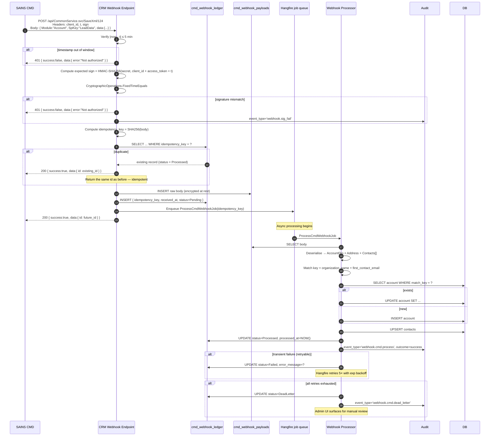

# CMD → CRM Webhook Sequence



## Failure semantics

| Condition | HTTP | Response body | Action |
|---|---|---|---|
| Timestamp out of window | 401 | `{ success:false, data:{ error:"Not authorized" } }` | Audit `webhook.sig_fail` |
| Signature mismatch | 401 | `{ success:false, data:{ error:"Not authorized" } }` | Audit `webhook.sig_fail` + alert on >10/min |
| Token expired | 401 | `{ success:false, data:{ error:"Token expired" } }` | — |
| Duplicate (same idempotency key) | 200 | `{ success:true, data:{ id: <original_id> } }` | No side effects |
| Unknown Module/SpKey | 400 | `{ success:false, data:{ error:"Unsupported module/spkey" } }` | Audit + alert to engineering |
| Body too large (>512KB) | 413 | `{ success:false, data:{ error:"Payload too large" } }` | Audit |
| Kill switch off | 503 | `{ success:false, data:{ error:"Service temporarily unavailable" } }` | Don't accept during maintenance |
| Valid | 200 | `{ success:true, data:{ id: <future_id> } }` | Enqueue + process async |
```
