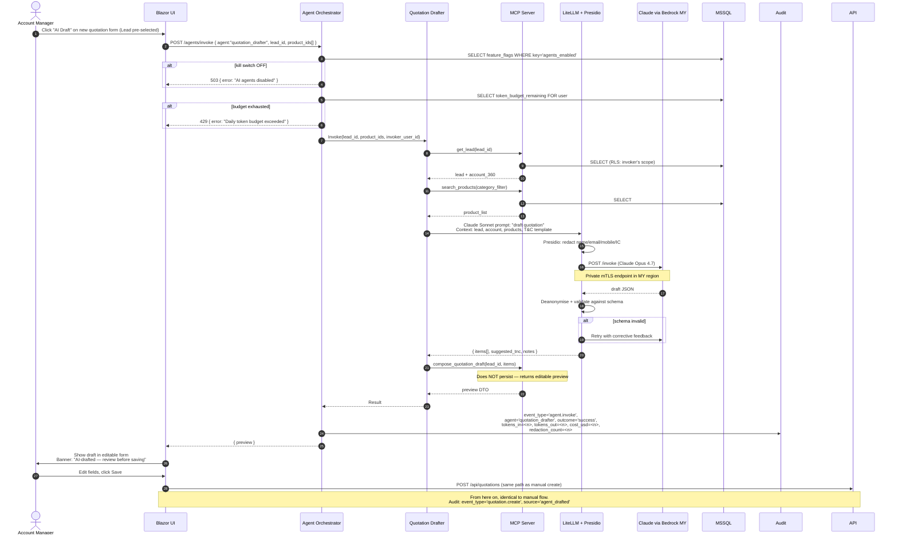
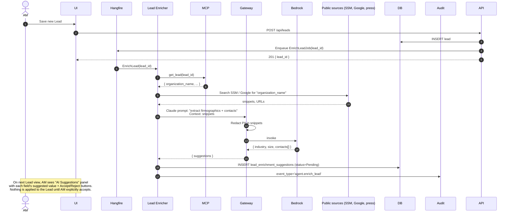
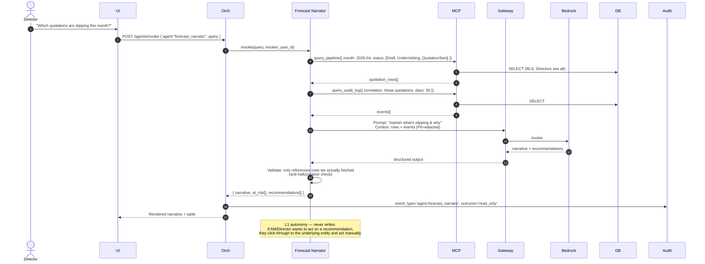

# v1.1 Agent Layer — Quotation Drafter Sequence

```mermaid
sequenceDiagram
    autonumber
    actor AM as Account Manager
    participant UI as Blazor UI
    participant Orch as Agent Orchestrator
    participant Drafter as Quotation Drafter
    participant MCP as MCP Server
    participant Gateway as LiteLLM + Presidio
    participant Bedrock as Claude via Bedrock MY
    participant DB as MSSQL
    participant Audit

    AM->>UI: Click "AI Draft" on new quotation form (Lead pre-selected)
    UI->>Orch: POST /agents/invoke { agent:"quotation_drafter", lead_id, product_ids[] }

    Orch->>DB: SELECT feature_flags WHERE key='agents_enabled'
    alt kill switch OFF
        Orch-->>UI: 503 { error: "AI agents disabled" }
    end

    Orch->>DB: SELECT token_budget_remaining FOR user
    alt budget exhausted
        Orch-->>UI: 429 { error: "Daily token budget exceeded" }
    end

    Orch->>Drafter: Invoke(lead_id, product_ids, invoker_user_id)

    Drafter->>MCP: get_lead(lead_id)
    MCP->>DB: SELECT (RLS: invoker's scope)
    MCP-->>Drafter: lead + account_360

    Drafter->>MCP: search_products(category_filter)
    MCP->>DB: SELECT
    MCP-->>Drafter: product_list

    Drafter->>Gateway: Claude Sonnet prompt: "draft quotation"<br/>Context: lead, account, products, T&C template
    Gateway->>Gateway: Presidio: redact name/email/mobile/IC
    Gateway->>Bedrock: POST /invoke (Claude Opus 4.7)
    Note over Gateway,Bedrock: Private mTLS endpoint in MY region
    Bedrock-->>Gateway: draft JSON
    Gateway->>Gateway: Deanonymise + validate against schema

    alt schema invalid
        Gateway->>Bedrock: Retry with corrective feedback
    end

    Gateway-->>Drafter: { items[], suggested_tnc, notes }

    Drafter->>MCP: compose_quotation_draft(lead_id, items)
    Note over MCP: Does NOT persist — returns editable preview
    MCP-->>Drafter: preview DTO

    Drafter-->>Orch: Result

    Orch->>Audit: event_type='agent.invoke',<br/>agent='quotation_drafter', outcome='success',<br/>tokens_in=<n>, tokens_out=<n>, cost_usd=<n>,<br/>redaction_count=<n>
    Orch-->>UI: { preview }

    UI->>AM: Show draft in editable form<br/>Banner: "AI-drafted — review before saving"

    AM->>UI: Edit fields, click Save
    UI->>API: POST /api/quotations (same path as manual create)
    Note over UI,API: From here on, identical to manual flow.<br/>Audit: event_type='quotation.create', source='agent_drafted'
```

## Lead Enricher sequence (on Lead create)

```mermaid
sequenceDiagram
    autonumber
    actor AM
    participant UI
    participant Hangfire
    participant Enricher as Lead Enricher
    participant MCP
    participant Gateway
    participant Bedrock
    participant Web as Public sources (SSM, Google, press)
    participant DB
    participant Audit

    AM->>UI: Save new Lead
    UI->>API: POST /api/leads
    API->>DB: INSERT lead
    API->>Hangfire: Enqueue EnrichLeadJob(lead_id)
    API-->>UI: 201 { lead_id }

    Hangfire->>Enricher: EnrichLead(lead_id)
    Enricher->>MCP: get_lead(lead_id)
    MCP-->>Enricher: { organization_name, ... }

    Enricher->>Web: Search SSM / Google for "organization_name"
    Web-->>Enricher: snippets, URLs

    Enricher->>Gateway: Claude prompt: "extract firmographics + contacts"<br/>Context: snippets
    Gateway->>Gateway: Redact PII in snippets
    Gateway->>Bedrock: invoke
    Bedrock-->>Gateway: { industry, size, contacts[] }
    Gateway-->>Enricher: { suggestions }

    Enricher->>DB: INSERT lead_enrichment_suggestions (status=Pending)
    Enricher->>Audit: event_type='agent.enrich_lead'

    Note over AM,UI: On next Lead view, AM sees "AI Suggestions" panel<br/>with each field's suggested value + Accept/Reject buttons.<br/>Nothing is applied to the Lead until AM explicitly accepts.
```

## Forecast Narrator sequence (read-only)

```mermaid
sequenceDiagram
    autonumber
    actor Dir as Director
    participant UI
    participant Orch
    participant Narrator as Forecast Narrator
    participant MCP
    participant Gateway
    participant Bedrock
    participant DB
    participant Audit

    Dir->>UI: "Which quotations are slipping this month?"
    UI->>Orch: POST /agents/invoke { agent:"forecast_narrator", query }

    Orch->>Narrator: Invoke(query, invoker_user_id)

    Narrator->>MCP: query_pipeline({ month: 2026-04, status: [Draft, UnderVetting, QuotationSent] })
    MCP->>DB: SELECT (RLS: Directors see all)
    MCP-->>Narrator: quotation_rows[]

    Narrator->>MCP: query_audit_log({ correlation: these quotations, days: 30 })
    MCP->>DB: SELECT
    MCP-->>Narrator: events[]

    Narrator->>Gateway: Prompt: "explain what's slipping & why"<br/>Context: rows + events (PII-redacted)
    Gateway->>Bedrock: invoke
    Bedrock-->>Gateway: narrative + recommendations
    Gateway-->>Narrator: structured output

    Narrator->>Narrator: Validate: only references rows we actually fetched<br/>(anti-hallucination check)
    Narrator-->>Orch: { narrative, at_risk[], recommendations[] }

    Orch->>Audit: event_type='agent.forecast_narrator', outcome='read_only'
    Orch-->>UI: Rendered narrative + table

    Note over Narrator: L1 autonomy — never writes.<br/>If AM/Director wants to act on a recommendation,<br/>they click through to the underlying entity and act manually.
```
